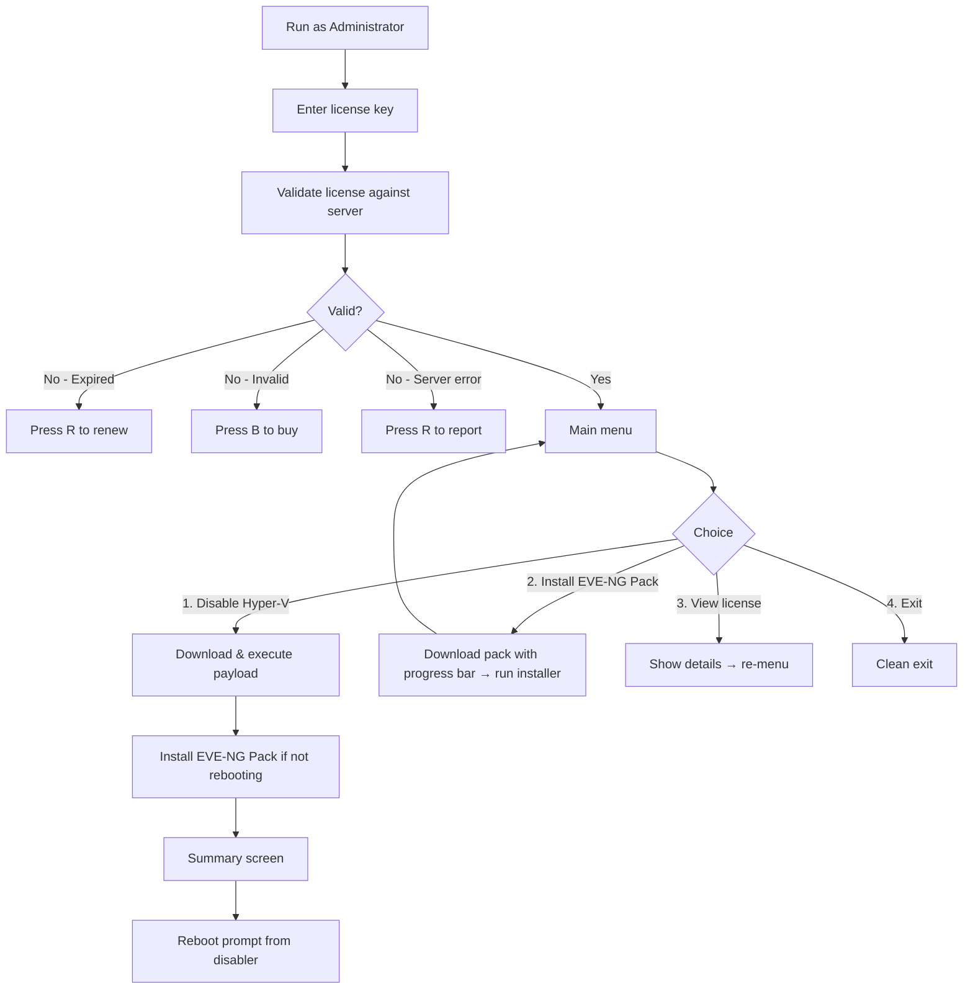

# Hyper-V Complete Disabler  v5.0.0

> Fully automated script to disable Hyper-V, VBS, Device Guard, Credential Guard, and Memory Integrity on Windows 10 / 11 — including 24H2.

**By [VigneshVijayK](https://github.com/VigneshVijayK)** | [LinkedIn](https://in.linkedin.com/in/vignesh-vijay-k)

---

## Features

- **Interactive menu** — choose to disable Hyper-V, install the EVE-NG Integration Pack, view license details, or exit
- **EVE-NG Integration Pack** — download and install the pack directly from the menu (with a live progress bar)
- **Step-counter progress** — clear `[1/5]` → `[5/5]` indicators throughout
- **Download progress bar** — real-time percentage and MB counter while downloading the integration pack
- **Post-execution summary** — full report with license info, timestamp, log path, and pack install status
- **Smart failure detection** — yellow "Completed with warnings" if any step fails, green "Completed" only when everything succeeds
- **Automatic logging** — every action is logged to `%TEMP%\hyperv-disabler.log` (append mode, keeps history across runs)
- **Empty key validation** — exits immediately if no key is entered, no wasted API calls
- **Color-coded output** — Cyan (headers), Yellow (steps/prompts), Green (success), Red (errors)

---

## Compatible With

| Platform | Status |
|---|---|
| **EVE-NG** | ✅ Supported |
| **VMware Workstation** | ✅ Supported |
| **VirtualBox** | ✅ Supported |
| **GNS3** | ✅ Supported |
| **QEMU** | ✅ Supported |

---

## How It Works



1. **Enter license key** — validated against the license server
2. **Main menu** — choose to disable Hyper-V, install the EVE-NG pack, view license details, or exit
3. **Disable Hyper-V** — payload runs in-memory (never touches disk), then the EVE-NG pack installs automatically (unless you rebooted via the disabler's prompt)
4. **Install EVE-NG Pack** — downloads from GitHub Releases with a live progress bar, then runs the installer interactively
5. **Summary screen** — shows status, log path, and pack install status
6. **Reboot prompt** — the disabler asks if you want to reboot now

---

## EVE-NG Integration Pack

The launcher can also download and install the **EVE-NG Integration Pack** for you.

- **From the menu** — choose option **2. Install EVE-NG Integration Pack only** to download and install the pack without disabling Hyper-V
- **After disabling Hyper-V** — if you did not reboot via the disabler's prompt, the pack installs automatically as the final step
- **Progress bar** — a live percentage and MB counter is shown while downloading (99 MB)
- **Interactive installer** — the pack's installer UI appears; follow the on-screen prompts to complete installation
- **Source** — downloaded from [GitHub Releases](https://github.com/VigneshVijayK/Disable-HyperV-EVE-NG/releases)

> If you chose to reboot via the disabler's prompt, the pack install is skipped. Run the launcher again and choose menu option **2** to install the pack.

---

## Quick Start — One Command

### Option A : Run from Command Prompt (CMD)

Open **CMD as Administrator** and paste this:

```cmd
powershell -NoProfile -ExecutionPolicy Bypass -Command "irm https://raw.githubusercontent.com/VigneshVijayK/Disable-HyperV-EVE-NG/main/Disable-HyperV-EVE-NG.ps1 | iex"
```

### Option B : Run from PowerShell

Open **PowerShell as Administrator** and paste this:

```powershell
Set-ExecutionPolicy Bypass -Scope Process -Force
irm https://raw.githubusercontent.com/VigneshVijayK/Disable-HyperV-EVE-NG/main/Disable-HyperV-EVE-NG.ps1 | iex
```

---

## License Key

This script requires a valid license key to run.

- **Don't have a key?** [Purchase a license here](https://vigneshvijayk.github.io/VigneshVijayK/)
- **Need to renew?** [Renew your license here](https://vigneshvijayk.github.io/VigneshVijayK/)
- **Have a key?** Enter it when prompted.

| Scenario | Action |
|----------|--------|
| Invalid key | Press **B** to visit purchase page |
| Expired key | Press **R** to visit renewal page |
| Server unreachable | Press **R** to report to developer |
| Empty key (Enter pressed) | Exits automatically — no API call made |

---

## How to Open CMD / PowerShell as Administrator

1. Press **Win + S** and type `cmd` or `powershell`
2. Right-click the result and select **Run as administrator**
3. Click **Yes** on the UAC prompt

---

## Requirements

| Requirement | Details |
|---|---|
| **OS** | Windows 10 (Build 19041+) or Windows 11 |
| **Privileges** | Must run as Administrator |
| **PowerShell** | Version 5.1 or later |
| **Internet** | Required for license validation |
| **BIOS** | VT-x (Intel) or AMD-V (AMD) must be enabled |

---

## Logging

All actions are automatically logged to:

```
%TEMP%\hyperv-disabler.log
```

- **Append mode** — history is preserved across multiple runs
- **Session separator** — each run starts with a timestamped separator line
- **Machine info** — computer name and OS version recorded per session
- **All actions logged** — license validation, menu choices, downloads, execution, errors

To view your log:

```powershell
notepad %TEMP%\hyperv-disabler.log
```

---

## License

All Rights Reserved.
